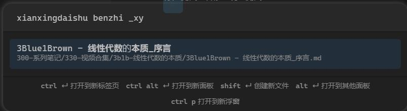

# Fuzzy Chinese Pinyin

平替 Obsidian 的核心插件搜索，提供中文拼音搜索的功能，其他功能与核心插件一致。

## 使用方法

### 文件搜索

插件增加命令 `Fuzzy Chinese Pinyin: Open Search`，为其设置快捷键即可更方便地使用。
可使用全拼或首字母，可以随便混合。

可以设置是否显示 tag 或打开繁体支持。

快捷键设置：
Obsidian -> 选项 -> 快捷键 -> 搜索 `Fuzzy` -> 给 `Fuzzy Chinese Pinyin: Open Search` 设置 `<Cmd+o>` 快捷键，就可以平替默认的 `快速切换：打开快速切换` 面板。

### 文件移动

命令 `Fuzzy Chinese Pinyin: Move File`，效果类似命令 `将文件移动到其他文件夹`。

### 命令搜索

命令 `Fuzzy Chinese Pinyin: Execute Command`，效果类似命令 `命令面板: 打开命令面板`。

快捷键设置：
Obsidian -> 选项 -> 快捷键 -> 搜索 `Fuzzy` -> 给 `Fuzzy Chinese Pinyin: Execute Command` 设置 `<Cmd+p>` 快捷键，就可以平替默认的 `命令面板：打开命令面板`。

### 标签

选项设置：
Obsidian -> 选项 -> 第三方插件 -> Fuzzy Chinese Pinyin -> 开启 `使用标签建议` 选项。

使用：
在笔记文档中直接输入 `#` 就会有中文标签建议（默认只有英文标签建议），可以继续输入拼音搜索中文标签，回车即可自动补全标签。

## 安装

直接在插件市场里安装即可。
