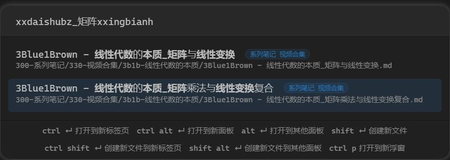

# Fuzzy Chinese Pinyin

为 Obsidian 提供中文拼音搜索的功能。

支持

1. 繁体
2. 双拼
3. 模糊音（双拼和模糊音不能同时开启）

## 使用方法

### 文件搜索

插件增加命令 `Fuzzy Chinese Pinyin: Open Search`，为其设置快捷键即可更方便地使用。
可使用全拼或首字母，可以随便混合。



特性：

1. 显示 tag
2. 使用路径搜索
3. 携带标签一起搜索（目前仅支持单个标签）

快捷键设置：
Obsidian -> 选项 -> 快捷键 -> 搜索 `Fuzzy` -> 给 `Fuzzy Chinese Pinyin: Open Search` 设置 `<Cmd+o>` 快捷键，就可以平替默认的 `快速切换：打开快速切换` 面板。

在文件 frontmatter 中设置 `linkText` 字段，可以将标题或者 block id 加入搜索（与 `alias` 不同的是，可以直接跳转到对应标题或块）。如

```
linkText:
  - 标题
  - 标题|别名
  - ^blockId
  - ^blockId|别名
```

### 文件移动

命令 `Fuzzy Chinese Pinyin: Move File`，效果类似命令 `将文件移动到其他文件夹`。
在文件列表中选择文件后，右键可一起移动，若设置了快捷键也可以快捷键打开，优先级大于当前页面文件。

特性：

1. 文件列表中选择文件或文件夹后调用此命令，可以同时移动多个文件或文件夹。
2. 按下 Tab 键直接补全文件夹路径到输入框

### 命令搜索

命令 `Fuzzy Chinese Pinyin: Execute Command`，效果类似命令 `命令面板: 打开命令面板`。

快捷键设置：
Obsidian -> 选项 -> 快捷键 -> 搜索 `Fuzzy` -> 给 `Fuzzy Chinese Pinyin: Execute Command` 设置 `<Cmd+p>` 快捷键，就可以平替默认的 `命令面板：打开命令面板`。

特性：

1. 置顶最近使用过的命令
2. 可自定义置顶的命令
3. `Ctrl O` 直接进入快捷键配置
4. `Alt I` 复制命令 ID，`Alt N` 复制命令名称

### 当前文档标题搜索

命令 `Fuzzy Chinese Pinyin: Search Heading`
对当前文档标题进行拼音搜索。

特性：

1. 隐藏第一级标题
2. 对标题进行缩进

### 双链

选项设置：
Obsidian -> 选项 -> 第三方插件 -> Fuzzy Chinese Pinyin -> 开启 `使用双链建议` 选项。

### 标签

选项设置：
Obsidian -> 选项 -> 第三方插件 -> Fuzzy Chinese Pinyin -> 开启 `使用标签建议` 选项。

使用：
在笔记文档中直接输入 `#` 就会有中文标签建议，可以继续输入拼音搜索中文标签，回车即可自动补全标签。
在 yaml 区的 `tag: ` 或 `tags: ` 后也有同样的效果。

## 安装

直接在插件市场里安装即可。

## 打赏

如果觉得插件好用，欢迎打赏支持作者。


